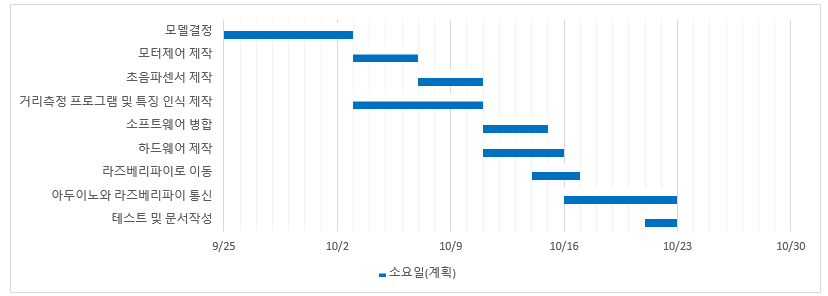

# 스마트 캐리어 프로젝트

## 팀명: 5조 | 테일러스위프트

### 목차
1. [개요](#개요)
2. [목표](#목표)
3. [시스템 아키텍처](#시스템-아키텍처)
4. [개발 진행 상황](#개발-진행-상황)
5. [결과](#결과)
6. [고찰](#고찰)
7. [향후 과제](#향후-과제)
8. [발표 자료](#발표-자료)
---

## 개요
스마트 캐리어 프로젝트는 시장에서 무거운 장바구니를 들고 다니는 할머니와 어머니를 보며 영감을 받았습니다. 자녀들이 도울 수 있는 경우도 있지만, 그렇지 못할 때는 자주 쉬어가며 힘들게 장을 보시는 모습을 보고, 자율주행 장바구니가 있다면 좋겠다는 생각을 하게 되었습니다.

현대의 객체 인식 기술은 다양한 환경에서 사람의 위치를 추적하고 그 거리를 정확하게 측정하는 데에 어려움이 있습니다. 특히, 사람들이 밀집된 환경이나 불규칙한 조명 아래에서 신뢰할 수 있는 정보를 제공하는 것이 중요하며, 사용자가 이동 방향을 실시간으로 확인할 수 있는 시스템이 필요합니다.

---

## 목표
이 프로젝트의 목표는 다음과 같습니다:

- 실시간으로 사람의 위치와 거리를 탐지하여 추적.
- 이동하는 인물의 방향에 따라 추적하며 객체의 거리를 측정하는 시스템 개발.

---

## 시스템 아키텍처

- 아키텍쳐
  

-구성도

- flowchart
  

---

## 개발 진행 상황

---

## 결과

- 다음 프레임에도 사용자를 인식하기 위해 IOU방식을 채택해서 진행함.
- 이때 사용자를 완전히 가리거나, 사용자 위치에 다른사람이 있을경우 다른 사람을 사용자로 인식함.

- monodepth모델의 경우 상대적인 거리를 추정하는 모델이라 depth의 값이 갑자기 변화하는 문제가 발생함.
- Cropped image를 사용하여 사용자만 있는 사진을 입력하여 사용자만의 거리를 측정하게 함.
- 이 과정에서 노이즈가 발생, 가우시안 블러를 이용하여 노이즈를 제거함
- RGB chanel 보다 Blue chanel만 을 이용하여 값을 안정화함.

- 초기 구성에서 방향의 판단을 바운딩 박스가 전부 특정영역에 들어와야 다른 방향으로 가는걸인식
- 이 과정에서 팔을 벌렸을때 바운딩 박스가 넘어 가지 않아 회전이 늦게 되는 문제가 발생
- MediaPipe의 poseestimation을 이용하여 어깨를 추측하여 바운딩 박스의 크기를 고정
- 바운딩 박스보단 어깨의 중심이 어느 영역에 위치했는가를 추정하여 방향을 결정 -> 딜레이가 줄어듬

- 시간관계상 서버를 통한 통신은 제작이 불가능 하여 테스트때 사용하던 Rc car앱의 Bluetooth protocol를 이용하여 구현

---

## 고찰

- 소프트웨어 설계중 cropped image에 대한 결과를 생각하지 않고 설계해서 실제 동작이 목표만큼 원할하지 않았던 점이 아쉬웠음.
- 초기 엣지 컴퓨팅을 구현하고자 하였으나, 처리속도가 기대에 못 미쳤으며, 이를 보완하기위해 cpu모델들로 설계해봤으나 2개이상의 모델을 사용할 경우 딜레이가 발생하여, 결국 Desktop에서 처리하게 된 점이 아쉬웠다
- 한정된 하드웨어 자원을 효율화하기 위해, 인터프리터 방식인 파이썬보다 컴파일 언어인 C++로 경량화를 시도하여, 당초 계획대로 오프라인 환경에서 구동을 시켜보지 못한 점이 아쉬웠다
- 하드웨어 작업 중에 위쪽으로 무게중심이 쏠리면서 바퀴가 들리는 현상이 있었습니다. 그 과정에서 아래쪽에 무게를 실어주면서 바퀴 들리는 현상은 해결하였지만 수납할 수 있는 물건의 무게따라 문제가 생기는 것을 개선하지 못 한 것이 아쉬웠습니다.
- 엣지 디바이스 스팩에대한 자료조사가 부족했다.

---

## 향후 과제

- iou대신 classification의 사진을 벡터로 변환하여 저장하는 기능을 통해 사용자를 고정시키는 방법
- 모델이 추가된 이후 delay가 얼마나 걸리는지 확인 및 개선
- 

---
## 발표 자료
https://docs.google.com/presentation/d/1gs7zfCVsGriqfyBAdbsQSrKQAs58_GKxZbZFjJTXn0Q/edit?usp=sharing

